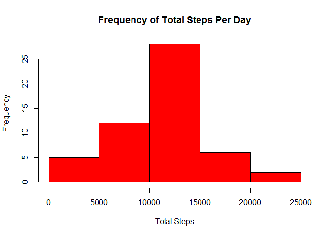
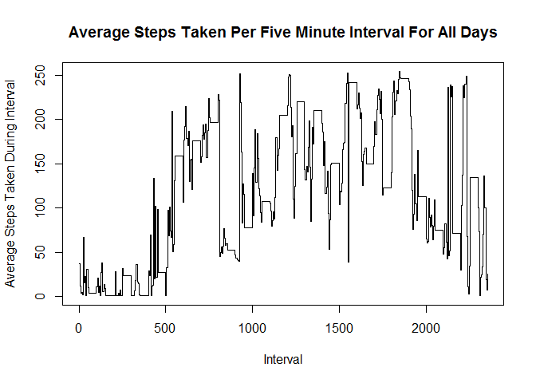
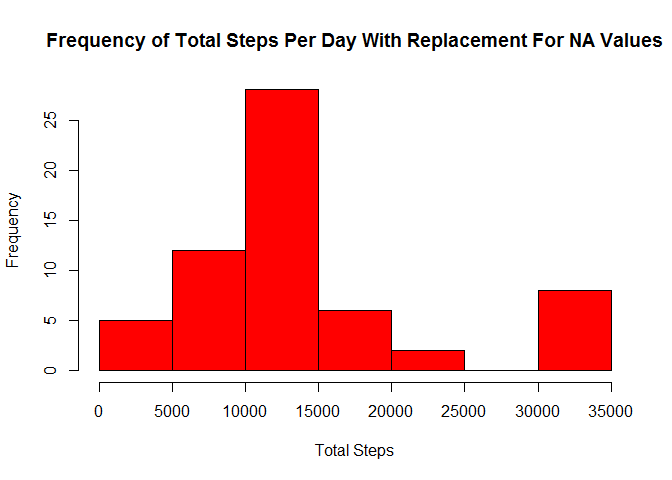
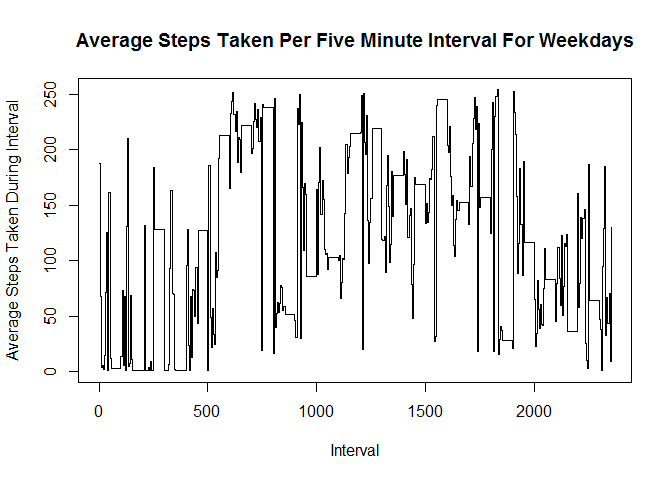
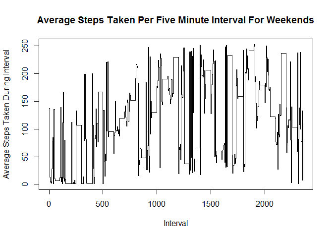

# Reproducible Research: Peer Assessment 1


## Loading and preprocessing the data


```r
##loading the libraries we'll use
library("plyr")
library("ggplot2")
library("reshape2")


##loading the data from the resource file
activityDF <- read.csv("activity.csv", header = TRUE)

##setting leading zeros for those times lacking them to generate a timestamp
activityDFTimes4 <- formatC(activityDF$interval, width = 4, format = "d", flag = "0")

##extracting the hours
activityDFTimesHour <- substr(activityDFTimes4, 1, 2)

##extracting the minutes
activityDFTimesMinute <- substr(activityDFTimes4, 3, 4)

##adding the colon
activityDF$Hour <- activityDFTimesHour
activityDF$Minute <- activityDFTimesMinute
activityDF$Time <- paste(activityDF$Hour, activityDF$Minute, sep = ":")

##adding the date and time to a single property
activityDF$Timestamp <- paste(activityDF$date, activityDF$Time, sep = " ")

##changing that property to a timestamp
activityDF$Timestamp <- as.POSIXct(activityDF$Timestamp)

##dropping unneeded columns
columnsToKeep <- c(1, 2, 6, 7)
activityDF <- activityDF[, columnsToKeep]

##removing unneeded variables
remove(activityDFTimes4, activityDFTimesHour, activityDFTimesMinute, columnsToKeep)

##dropping NA values from the working dataset
activityDFNAsRemoved <- na.omit(activityDF)
```


## What is mean total number of steps taken per day?

```r
##function for taking the sum of the days steps
findDailyTotal <- function(x) {
        result <- sum(x$steps)
        result
}

##splitting the dataset by day and sending to the function to find the total of the days steps
daySteps <- ddply(activityDFNAsRemoved, .(date), findDailyTotal)
colnames(daySteps) <- c("Date", "TotalSteps")

##finding the mean & media of steps taken per day
meanTotalNumberOfStepsTakenPerDay <- as.numeric(mean(daySteps$TotalSteps))
medianTotalNumberOfStepsTakenPerDay <- as.numeric(median(daySteps$TotalSteps))

##creating the histogram
hist(daySteps$TotalSteps, col = "Red", main = "Frequency of Total Steps Per Day", xlab = "Total Steps", ylab = "Frequency")
```

 


```r
meanTotalNumberOfStepsTakenPerDay
```

```
## [1] 10766.19
```


```r
medianTotalNumberOfStepsTakenPerDay
```

```
## [1] 10765
```

## What is the average daily activity pattern?

```r
## creating a list of the all available time intervals
listOfTimes <- unique(activityDF$Time)

## creating the function to summarize the data accross those intervals for all days
spinByFiveMins <- function(y) {
        row.names(y) <- y$Time
        test <- listOfTimes
        selector <- y$Time %in% listOfTimes
        result <- y[,1]
}

## splitting the dataset by day and calling the function above to summarize the steps by interval        
dailyActivityList <- ddply(activityDFNAsRemoved, .(date), spinByFiveMins)

##setting column names in plain english
colnames(dailyActivityList) <- append(c("day"), listOfTimes)

##transposing the data for easier handling
dailyActivityList <- dcast(melt(dailyActivityList, id.vars = "day"), variable ~ day)
dailyActivityList <- dailyActivityList[, -1]

##taking the average for each interval & creating new dataset for it
avgStepsPerFiveMinuteInterval <- rowMeans(dailyActivityList)
rownames(dailyActivityList) <- listOfTimes

##transposing for easier handling
fiveMinAverages <- as.data.frame(cbind(avgStepsPerFiveMinuteInterval, listOfTimes))
fiveMinAverages[,1] <- as.numeric(fiveMinAverages[,1])
fiveMinAverages[,2] <- as.character(fiveMinAverages[,2])
rownames(fiveMinAverages) <- fiveMinAverages[,2]

##adding back interval for easier plotting
Hours <- substr(listOfTimes, 1, 2)
Minutes <- substr(listOfTimes, 4, 5)
interval <- as.numeric(paste(Hours, Minutes, sep=""))

##finding the five minute interval with the highest average number of steps
intervalWithHighestAverageNumberOfSteps <- fiveMinAverages[which.max(fiveMinAverages$avgStepsPerFiveMinuteInterval),2]

##plotting
plot(interval, fiveMinAverages$avgStepsPerFiveMinuteInterval, type = "s", main = "Average Steps Taken Per Five Minute Interval For All Days", xlab = "Interval", ylab = "Average Steps Taken During Interval")
```

 


```r
intervalWithHighestAverageNumberOfSteps
```

```
## [1] "18:45"
```

## Imputing missing values


```r
##Calculate and report the total number of missing values in the dataset (i.e. the total number of rows with NAs)
##this is equal to the difference between the number of rows in the original dataset, and the number of rows in the dataset after the NAs were removed

totalNAs <- as.numeric(nrow(activityDF) - nrow(activityDFNAsRemoved))
```


```r
totalNAs
```

```
## [1] 2304
```


```r
##Devise a strategy for filling in all of the missing values in the dataset. The strategy does not need to be sophisticated. For example, you could use the mean/median for that day, or the mean for that 5-minute interval, etc.
##I choose the mean for the 5-minute interval

##I will first separate just the NA values from the activityDF

NAsNotPresentSelector <- activityDF$Timestamp %in% activityDFNAsRemoved$Timestamp
NARecords <- activityDF[!NAsNotPresentSelector, ]
NARecords <- droplevels.data.frame(NARecords)

##for loop to lookup average steps by five mintue interval in NA Records
countOfNAs <- as.numeric(nrow(NARecords))
for(i in 1:countOfNAs) 
{
        intervalToLookup <- NARecords[i, 3]
        findTheRecord <- as.numeric(grep(intervalToLookup, fiveMinAverages$listOfTimes))
        averageValue <- fiveMinAverages[findTheRecord, 1]
        NARecords[i, 1] <- averageValue
}

##merge NA records with non-NA Records for a reconstituted dataset
allRecordsDF <- rbind(NARecords, activityDFNAsRemoved)

##repeat the histogram, median and mode to determine differences created by substituing values for NAs

##splitting the dataset by day and sending to the function to find the total of the days steps
dayStepsWithReplacement <- ddply(allRecordsDF, .(date), findDailyTotal)
colnames(dayStepsWithReplacement) <- c("Date", "TotalSteps")

##finding the mean & media of steps taken per day
meanTotalNumberOfStepsTakenPerDayWithReplacement <- as.numeric(mean(dayStepsWithReplacement$TotalSteps))
medianTotalNumberOfStepsTakenPerDayWithReplacement <- as.numeric(median(dayStepsWithReplacement$TotalSteps))

##creating the histogram
hist(dayStepsWithReplacement$TotalSteps, col = "Red", main = "Frequency of Total Steps Per Day With Replacement For NA Values", xlab = "Total Steps", ylab = "Frequency")
```

 


```r
meanTotalNumberOfStepsTakenPerDayWithReplacement
```

```
## [1] 13665.44
```


```r
medianTotalNumberOfStepsTakenPerDayWithReplacement
```

```
## [1] 11458
```

## The addition of the values in place of the NAs did slightly alter the outcome of the data

## Are there differences in activity patterns between weekdays and weekends?

```r
##adding a day of the week indicator to the "All Records" dataset
allRecordsDF$day <- weekdays(allRecordsDF$Timestamp)

##setting boolean values for weekday/weekend days
weekend <- c("Saturday", "Sunday")
allRecordsDF$weekday <- !(allRecordsDF$day %in% weekend)

##splitting the dataset by the weekday/weekend boolean
allRecordsSplit <- split(allRecordsDF, allRecordsDF$weekday)
weekendRecords <- allRecordsSplit[[1]]
weekdayRecords <- allRecordsSplit[[2]]

## splitting the dataset by day and calling the function above to summarize the steps by interval        
dailyActivityListWeekdaySplit <- ddply(weekdayRecords, .(date), spinByFiveMins)
dailyActivityListWeekendSplit <- ddply(weekendRecords, .(date), spinByFiveMins)

##setting column names in plain english
colnames(dailyActivityListWeekdaySplit) <- append(c("day"), listOfTimes)
colnames(dailyActivityListWeekendSplit) <- append(c("day"), listOfTimes)

##transposing the data for easier handling
dailyActivityListWeekdaySplit <- dcast(melt(dailyActivityListWeekdaySplit, id.vars = "day"), variable ~ day)
dailyActivityListWeekdaySplit <- dailyActivityListWeekdaySplit[, -1]
dailyActivityListWeekendSplit <- dcast(melt(dailyActivityListWeekendSplit, id.vars = "day"), variable ~ day)
dailyActivityListWeekendSplit <- dailyActivityListWeekendSplit[, -1]

##taking the average for each interval & creating new dataset for it
avgStepsPerFiveMinuteIntervalWeekday <- rowMeans(dailyActivityListWeekdaySplit)
rownames(dailyActivityListWeekdaySplit) <- listOfTimes
avgStepsPerFiveMinuteIntervalWeekend <- rowMeans(dailyActivityListWeekendSplit)
rownames(dailyActivityListWeekendSplit) <- listOfTimes

##transposing for easier handling
fiveMinAveragesWeekday <- as.data.frame(cbind(avgStepsPerFiveMinuteIntervalWeekday, listOfTimes))
fiveMinAveragesWeekday[,1] <- as.numeric(fiveMinAveragesWeekday[,1])
fiveMinAveragesWeekday[,2] <- as.character(fiveMinAveragesWeekday[,2])
rownames(fiveMinAveragesWeekday) <- fiveMinAveragesWeekday[,2]
fiveMinAveragesWeekend <- as.data.frame(cbind(avgStepsPerFiveMinuteIntervalWeekend, listOfTimes))
fiveMinAveragesWeekend[,1] <- as.numeric(fiveMinAveragesWeekend[,1])
fiveMinAveragesWeekend[,2] <- as.character(fiveMinAveragesWeekend[,2])
rownames(fiveMinAveragesWeekend) <- fiveMinAveragesWeekend[,2]


##adding back interval for easier plotting
Hours <- substr(listOfTimes, 1, 2)
Minutes <- substr(listOfTimes, 4, 5)
interval <- as.numeric(paste(Hours, Minutes, sep=""))

##finding the five minute interval with the highest average number of steps
WeekdayintervalWithHighestAverageNumberOfSteps <- fiveMinAveragesWeekday[which.max(fiveMinAveragesWeekday$avgStepsPerFiveMinuteIntervalWeekday),2]
WeekendintervalWithHighestAverageNumberOfSteps <- fiveMinAveragesWeekend[which.max(fiveMinAveragesWeekend$avgStepsPerFiveMinuteIntervalWeekend),2]


##plotting
plot(interval, fiveMinAveragesWeekday$avgStepsPerFiveMinuteIntervalWeekday, type = "s", main = "Average Steps Taken Per Five Minute Interval For Weekdays", xlab = "Interval", ylab = "Average Steps Taken During Interval")
```

 

```r
plot(interval, fiveMinAveragesWeekend$avgStepsPerFiveMinuteIntervalWeekend, type = "s", main = "Average Steps Taken Per Five Minute Interval For Weekends", xlab = "Interval", ylab = "Average Steps Taken During Interval")
```

 


```r
WeekdayintervalWithHighestAverageNumberOfSteps
```

```
## [1] "18:30"
```


```r
WeekendintervalWithHighestAverageNumberOfSteps
```

```
## [1] "19:05"
```

